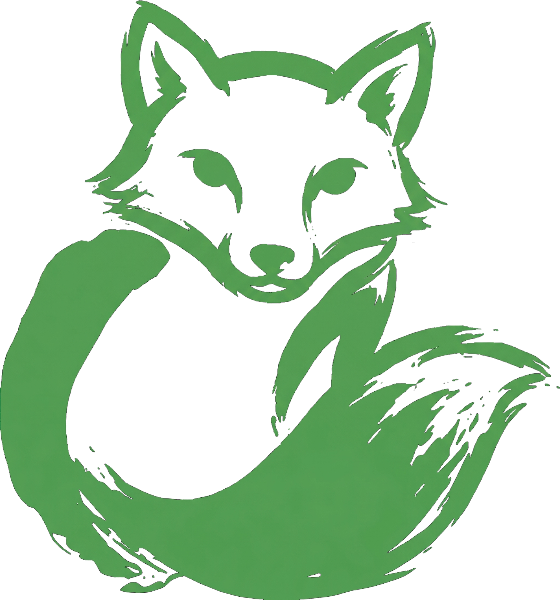

<p align="center">
  
</p>

<h1 align="center">crw-camofox</h1>

<p align="center">
  Self-hosted, Rust-native web crawler &amp; scraper for AI agents
</p>

The open-source alternative to Firecrawl: one static Rust binary, ~50 MB RAM
idle, a Firecrawl-compatible REST API on **both `/v1/*` and `/v2/*`** (scrape,
crawl, map, search, extract, plus v2 batch & parse) — a drop-in for the official
Firecrawl SDKs — plus first-class MCP. Self-host free under AGPL-3.0.

**This fork** swaps the browser layer to [Camofox](https://github.com/redf0x1/camofox-browser)
(Firefox anti-detect) and re-backs search on it — details [below](#-this-is-the-camofox-fork).
Upstream offers a managed API at `api.fastcrw.com`; this fork is self-host only.

<p align="center">
  <a href="https://github.com/adambenhassen/crw-camofox/actions/workflows/ci.yml"></a>
  <a href="LICENSE"></a>
  <a href="https://github.com/adambenhassen/crw-camofox/stargazers"></a>
</p>

Works with: [Claude Code](https://docs.fastcrw.com/mcp-clients/#claude-code) · [Cursor](https://docs.fastcrw.com/mcp-clients/#cursor) · [Windsurf](https://docs.fastcrw.com/mcp-clients/#windsurf) · [Cline](https://docs.fastcrw.com/mcp-clients/#cline) · [Copilot](https://docs.fastcrw.com/mcp-clients/#any-mcp-client) · [Continue.dev](https://docs.fastcrw.com/mcp-clients/#continue) · [Codex](https://docs.fastcrw.com/mcp-clients/#openai-codex-cli) · [Gemini CLI](https://docs.fastcrw.com/mcp-clients/#gemini-cli)

---

## 🦊 This is the Camofox fork

This is a fork of [`crw`](https://github.com/us/crw) that swaps the browser layer
to [**Camofox**](https://github.com/redf0x1/camofox-browser) (the Camoufox/Firefox
anti-detect browser, driven over its REST API) and re-backs search on it. Changes
vs. upstream — all **additive and config-toggled**, so nothing upstream is deleted
and the fork stays easy to sync:

| Area | Upstream `crw` | This fork |
|------|----------------|-----------|
| Default JS render ladder | `HTTP → LightPanda → Chrome` (CDP) | `HTTP → LightPanda → Camofox` (Firefox) |
| Stealth tier | browserless Chromium (SSPL) | Camofox — engine-level fingerprint evasion |
| `/v1/search` backend | SearXNG sidecar | **8 engines built in** — Google, Bing, DuckDuckGo, Wikipedia, YouTube, Reddit, Amazon, GitHub (no sidecar) |
| Interactive MCP | `crw-browse` (CDP, 2 tools) | Upstream **[`camofox-mcp`](https://github.com/redf0x1/camofox-mcp)** wired into the Docker stack — 47 tools over Camofox REST |

**What sets this fork apart:**

- **One less moving part.** Upstream's `/v1/search` needs a SearXNG sidecar; this fork
  searches Google through the **same Camofox browser it already runs to render pages**.
  `docker compose up` gives you working search with no extra container to deploy,
  version, or keep healthy.
- **Search that actually returns results.** In the production setup below, the SearXNG
  backend came back **empty for every query**; the Camofox-driven backend (Google by
  default) reliably returns real results.
- **Anti-detection at the engine level.** Camofox is Camoufox (Firefox) with fingerprint
  evasion **built into the browser**, not a CDP-driven Chrome hardened after the fact —
  and one browser covers both rendering *and* search, so there's no Chromium heap plus a
  search sidecar to run side by side.
- **Many engines, one ranked list.** Search defaults to Google but can query any combination of
  Google, Bing, DuckDuckGo, Wikipedia, YouTube, Reddit, Amazon, and GitHub in a single call
  (run sequentially, so latency scales with engine count), deduping by URL and agreement-ranking
  the merged results — where upstream is tied to one SearXNG instance.

**Field notes — used in production by Hermes.** This fork backs the **Hermes**
agent over MCP, with Hermes' built-in `web` and `browser` tools **disabled** so
every fetch/search routes through this fork instead of its flaky native tools.
In that setup the upstream **SearXNG backend was returning nothing at all** —
empty results for every query. The **Camofox-driven Google backend reliably
finds results**, and the Camofox render tier even **loads pages sitting behind
bot checks** that the previous stack couldn't get past.

---

## Why crw-camofox?

- **Rust-native engine** — the core is one static Rust binary (no Redis, Node.js, or Python). The Camofox (Firefox) browser runs as a separate container, pulled in only for JS rendering, stealth, and search — plain HTTP fetches never touch it.
- **Light idle footprint** — the engine idles around ~50 MB; the Camofox browser only spins up for heavy renders. Browser-render-first stacks (Firecrawl, Crawl4AI) carry a Chromium heap baseline measured in hundreds of MB before a single request lands.
- **Anti-detect by default** — the stealth tier is Camofox (Camoufox/Firefox with engine-level fingerprint evasion), and search runs through the same browser, so bot-walled pages and web search both work without bolting on a separate Chromium or SearXNG sidecar.
- **Firecrawl-compatible drop-in** — both the `/v1/*` and `/v2/*` surfaces (scrape, crawl, map, search, extract; plus v2-only batch & parse) with compatible request/response shapes. The v2 API is a drop-in for the official `firecrawl-py` v4 SDK (`FirecrawlApp(api_url="http://localhost:3000")`) — swap the base URL and keep your code.
- **Change tracking** — diff a page against a prior snapshot (markdown git-diff, per-field JSON, or both) with an optional LLM "meaningful-change" judge. A stateless `changeTracking` primitive in the engine — wire it into your own scheduler. See the [Monitoring docs](https://us.github.io/crw/monitoring).
- **AGPL-3.0, self-host only** — run the whole stack yourself under AGPL-3.0. This fork operates no managed tier: no account, no usage metering, no API keys.

---

## Comparison Table

Qualitative positioning of this fork vs. upstream `crw` and the three
most-cited alternatives. Descriptive shape, not a benchmark.

| | **crw-camofox** | fastCRW (upstream) | Firecrawl | Crawl4AI | Spider |
|---|---|---|---|---|---|
| Language | Rust | Rust | Node.js + Playwright | Python + Playwright | Rust |
| License | AGPL-3.0 | AGPL-3.0 (commercial avail.) | AGPL-3.0 (commercial avail.) | Apache-2.0 | Source-available / commercial ([spider.cloud](https://spider.cloud)) |
| Self-host footprint | Static binary (~8 MB) + one browser container | Static binary (~8 MB) + browser + SearXNG sidecar | Multi-container (~500 MB+ image) | ~2 GB image (browser bundled) | Managed-first; self-host via crate |
| Memory baseline (idle) | ~50 MB | ~50 MB | Large (Chromium heap) | Large (Chromium heap) | Light (Rust) |
| Stealth tier | **Anti-detect by default** (Camofox/Firefox) | browserless Chromium (SSPL), opt-in | Playwright Chromium | Playwright Chromium | — |
| Search backend | **8 engines** (Google, Bing, DuckDuckGo, Wikipedia, YouTube, Reddit, Amazon, GitHub) | SearXNG sidecar | Built-in | Built-in | Built-in |
| Firecrawl-compat API | Yes — **v1 + v2** | Yes — **v1 + v2** | Native | No | No |
| MCP server | `crw-mcp` **+ 47** interactive-browser tools | `crw-mcp` only | Separate package | Community add-on | No first-party |
| Hosted option | Self-host | `api.fastcrw.com` | firecrawl.dev | None official | spider.cloud (primary product) |

Pricing/spec cells where claimed link to the vendor page; everything else
is the qualitative architectural shape, not a comparison number.

---

## Quickstart

Self-host the full stack with one command — no auth:

```bash
docker compose up -d        # crw + lightpanda + camofox + camofox-mcp
```

This brings up the REST API on `localhost:3000` plus the real render ladder
(HTTP → LightPanda → Camofox) and Camofox-driven search, so JS-heavy pages and
web search work out of the box.

### REST API

Firecrawl-compatible (`/v1/*` + `/v2/*`) — point any Firecrawl client at
`http://localhost:3000`, or call it directly:

```bash
# /v1/scrape — URL → markdown / HTML / JSON / links
curl http://localhost:3000/v1/scrape \
  -H "Content-Type: application/json" \
  -d '{"url":"https://example.com","formats":["markdown"]}'
```

```bash
# /v1/extract — structured JSON from a URL via a JSON Schema
curl http://localhost:3000/v1/extract \
  -H "Content-Type: application/json" \
  -d '{
    "url":"https://example.com",
    "schema":{"type":"object","properties":{"title":{"type":"string"}}}
  }'
```

```bash
# /v1/crawl — async multi-page job (returns a job id; poll with /v1/crawl/:id)
curl http://localhost:3000/v1/crawl \
  -H "Content-Type: application/json" \
  -d '{"url":"https://docs.example.com","maxDepth":2,"maxPages":50}'
```

### MCP

Point any MCP-compatible agent (Claude Code, Cursor, Windsurf, Cline, Continue.dev,
Codex, Gemini CLI) at the running server over the Streamable HTTP transport — it
exposes 6 scraping tools (`crw_scrape`, `crw_crawl`, `crw_check_crawl_status`,
`crw_map`, `crw_search`, `crw_parse_file`) with no bespoke glue:

```bash
claude mcp add --transport http crw http://localhost:3000/mcp
```

**Interactive browser automation:** the scraping tools above *fetch* pages; for
agents that must *operate* a site across steps (log in, fill forms, click through
flows), the Docker stack runs the upstream
**[`camofox-mcp`](https://github.com/redf0x1/camofox-mcp)** server, which drives
a live [Camofox](https://github.com/redf0x1/camofox-browser) (Firefox) browser —
47 tools (navigate, snapshot, click, type, press, scroll, evaluate, screenshot,
cookies, …) over MCP. It runs as a **separate** MCP server (not routed through
crw's `/mcp`), published on `localhost:9378` by the Compose stack:

```bash
claude mcp add --transport http camofox http://localhost:9378/mcp
```

These tools drive a real browser and run unauthenticated on loopback by default;
before exposing them beyond localhost, set `CAMOFOX_HTTP_API_KEY` in `.env`. See
the upstream [camofox-mcp docs](https://github.com/redf0x1/camofox-mcp).

---

## Build from source

This fork is distributed as the multi-arch Docker image
**`ghcr.io/adambenhassen/crw-camofox`** (`linux/amd64` + `linux/arm64`) used by the
Compose stack above; upstream's `npm`/`pip`/`brew`/`cargo`/`apt` packages are
**not** this fork (they default to Chrome + SearXNG). To build the binaries yourself:

```bash
git clone https://github.com/adambenhassen/crw-camofox
cd crw-camofox
cargo build --release -p crw-server --features cdp,camofox -p crw-mcp -p crw-cli
```

---

## API endpoints

| Method | Endpoint | Description |
|---|---|---|
| `POST` | `/v1/scrape` | Scrape a single URL, optionally with LLM extraction or summary |
| `POST` | `/v1/crawl` | Start async BFS crawl (returns job ID) |
| `GET` | `/v1/crawl/:id` | Check crawl status and retrieve results |
| `DELETE` | `/v1/crawl/:id` | Cancel a running crawl job |
| `POST` | `/v1/map` | Discover all URLs on a site |
| `POST` | `/v1/extract` | Structured JSON extraction from a URL via JSON Schema |
| `POST` | `/v1/search` | Web search via Camofox-driven engines (Google default; 8 selectable), with optional content scraping |
| `POST` | `/v1/change-tracking/diff` | Diff a scrape against a supplied snapshot (the [monitoring](https://us.github.io/crw/monitoring) primitive) — single or batch |
| `GET` | `/health` | Health check (no auth required) |
| `POST` | `/mcp` | Streamable HTTP MCP transport |

**Firecrawl v2 surface** — `scrape`, `crawl`, `map`, `search` are also served under `/v2/*` with Firecrawl v2 request/response shapes, plus v2-only `POST /v2/batch/scrape`, `POST /v2/parse` (PDF/doc → markdown), and `GET /v2/crawl/active`. This makes the official `firecrawl-py` v4 SDK a drop-in: `FirecrawlApp(api_url="http://localhost:3000")`.

Full reference at [docs.fastcrw.com/#rest-api](https://docs.fastcrw.com/#rest-api).
The Firecrawl compatibility matrix (field-by-field diff) lives in
[`COMPATIBILITY-firecrawl.md`](COMPATIBILITY-firecrawl.md).

---

## Architecture

```
┌─────────────────────────────────────────────┐
│                 crw-server                  │
│         Axum HTTP API + Auth + MCP          │
├──────────┬──────────┬───────────────────────┤
│ crw-crawl│crw-extract│    crw-renderer      │
│ BFS crawl│ HTML→MD   │  HTTP + LightPanda   │
│ robots   │ LLM/JSON  │  + Camofox (Firefox) │
│ sitemap  │ clean/read│  auto-detect SPA     │
├──────────┴──────────┴───────────────────────┤
│                 crw-core                    │
│        Types, Config, Errors                │
└─────────────────────────────────────────────┘
```

| Crate | Description |
|-------|-------------|
| [`crw-core`](crates/crw-core) | Core types, config, and error handling |
| [`crw-renderer`](crates/crw-renderer) | HTTP + LightPanda (CDP) + Camofox (Firefox) render ladder |
| [`crw-extract`](crates/crw-extract) | HTML → markdown/plaintext extraction |
| [`crw-crawl`](crates/crw-crawl) | Async BFS crawler with robots.txt & sitemap |
| [`crw-server`](crates/crw-server) | Axum API server (Firecrawl-compatible) |
| [`crw-mcp`](crates/crw-mcp) | MCP stdio server (embedded + proxy mode) |
| [`crw-cli`](crates/crw-cli) | Standalone CLI (`crw` binary, no server) |

[Full architecture docs →](https://docs.fastcrw.com/architecture/)

---

## Security

- **SSRF protection** — blocks loopback, private IPs, cloud metadata (`169.254.x.x`), IPv6 mapped addresses, and non-HTTP schemes (`file://`, `data:`)
- **Auth** — optional Bearer token with constant-time comparison
- **robots.txt** — RFC 9309 compliant with wildcard patterns
- **Rate limiting** — token-bucket algorithm, returns 429 with `error_code`
- **Resource limits** — max request body 1 MB; per-crawl depth and page count bounded (configurable; defaults: depth 2, 100 pages)

[Full security docs →](https://docs.fastcrw.com/self-hosting-hardening/)

---

## Contributing

Contributions are welcome — issues and PRs both.

1. Fork the repository
2. Install pre-commit hooks: `make hooks`
3. Create your feature branch (`git checkout -b feat/my-feature`)
4. Commit your changes (`git commit -m 'feat: add my feature'`)
5. Push to the branch (`git push origin feat/my-feature`)
6. Open a Pull Request

The pre-commit hook runs the same checks as CI (`cargo fmt`, `cargo clippy`,
`cargo test`). Run manually with `make check`.

<a href="https://github.com/us/crw/graphs/contributors">
  
</a>

---

## License

crw-camofox is open source under [AGPL-3.0](LICENSE). If you embed it in a
closed-source product or expose it as a hosted service to third parties,
AGPL's source-availability requirements apply to your deployment. This fork
is community-maintained and self-host only — it offers no managed tier or
commercial carve-out; for commercial licensing, see [upstream `crw`](https://github.com/us/crw).

---

**It is the sole responsibility of end users to respect websites' policies
when scraping.** Users are advised to adhere to applicable privacy
policies and terms of use. By default, crw-camofox respects `robots.txt`
directives.
